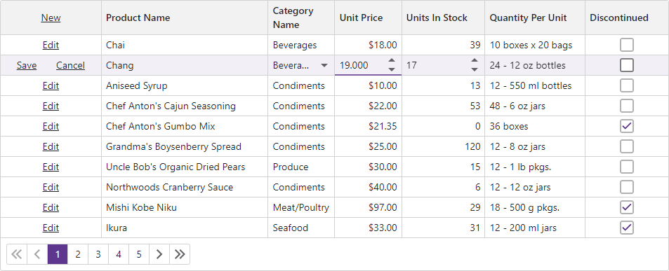

<!-- default badges list -->

<!-- default badges end -->
# Grid for Blazor – How to enable inline data editing

This example demonstrates how to enable inline data editing in the DevExpress Blazor [Grid](https://docs.devexpress.com/Blazor/403143/grid) component. 

Set the Grid's [EditMode](https://docs.devexpress.com/Blazor/DevExpress.Blazor.DxGrid.EditMode) property to `EditRow` to display inline editors instead of the edited row. You can also set the [EditorRenderMode](https://docs.devexpress.com/Blazor/DevExpress.Blazor.DxGrid.EditorRenderMode) property to `Integrated` to hide editor borders and render in-place editors that occupy entire cells.

The Grid automatically generates and configues editors for data columns based on assosiated data types. Use a data column's [EditSettings](https://docs.devexpress.com/Blazor/DevExpress.Blazor.DxGridDataColumn.EditSettings) property to customize the default editor generated for this column. This example customizes the spin editor generated for the **Unit Price** column and replaces the **Category Name** column's spin editor with a combo box.

## Documentation 

* [Edit Data](https://docs.devexpress.com/Blazor/403454/components/grid/edit-data)
* [Validate User Input](https://docs.devexpress.com/Blazor/404443/components/grid/validation)

## Files to Review:

* [Index.razor](./EditRow/Pages/Index.razor)
